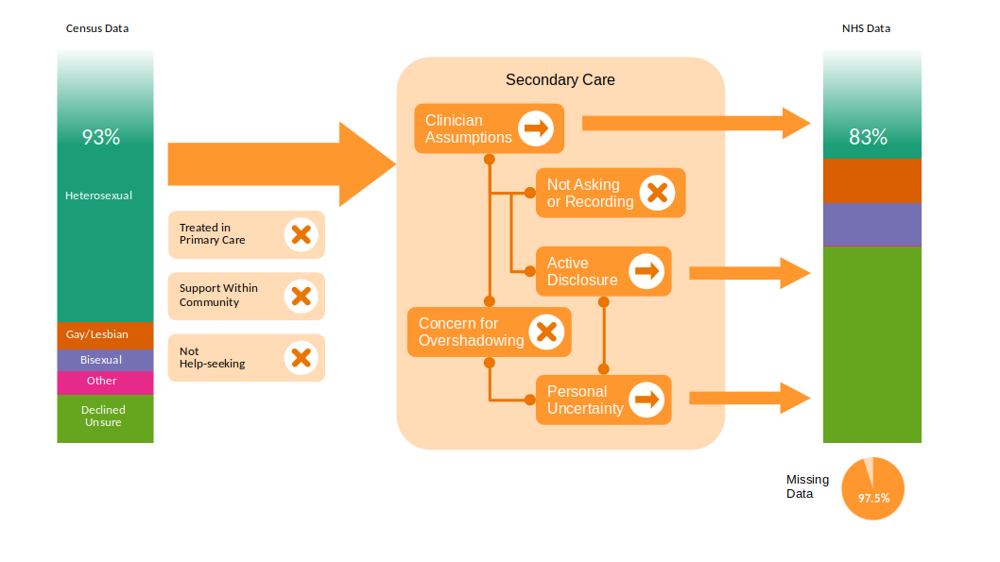

# The Problem
There is widespread recognition that if data is unrepresentative then any inferences derived from that data are biased -- a [problem](https://catalogofbias.org/) that potentiallly affects all clinical research and is particularly salient for research using electronic health records. 

To start with a simple example: assume we extract data from a clinical database that has accumulated over time from people receiving routine clinical care at a hospital -- this is the approach chrono**sig** uses -- and we have available to us 10,000 people's diagnoses and demographic data.

Imagine we are interested in the age distribution of people with a certain diagnosis *X*.  We interrogate our data with the question: 

  * *"How many people aged 12 to 21 years have a diagnosis X?"* 

finding that there are only a handful of people, say 10.  To examine this result further, we then ask:

  * *"Of our database of 10,000 people, how many are aged 12 to 21 years"*

discovering that only 100 people are identified as being aged between 12 to 21 years, or 0.01%.  This seems suspicious; we know that young people make up much more than 0.01% of the population generally, so we ask why there are so few young people in our data.  We  discover that, in the hospital we obtained the data from, the clinical records of young people below the age of 19 years are handled differently and in fact, were not included at all in the sample of data available to us.  

What we have *actually* shown is that in people aged *between 19 and 21 who are included in our database*, there were 10 diagnoses of *X*.  

This is an example of where system processes (i.e. young people's data being stored separately) results in grossly incorrect (biased) inferences.  

# Examining Bias in Data
In chrono**sig**, we have committed to being transparent about the data we use and the [potential for bias](https://www.medrxiv.org/content/10.1101/2021.11.23.21266750v1.full.pdf) being introduced as a result of factors such as under-representation and systemic processes that impinge on the available data.  We are aware that while auditing our data is necessary, it is not sufficient and represents only a starting point.  

We choose to start this process by exploring how people from the LGBTQ+ community are represented in the data available to the project -- this is because research has shown that [this community have mental health needs](https://www.mentalhealth.org.uk/explore-mental-health/mental-health-statistics/lgbtiq-people-statistics) that differ from other groups and where the organisation of NHS services might not be compatible with the needs of the community (Johnson et al, 2007).   

We interrogated the demographic data from one large regional secondary mental health care provider (NHS Trust) participating in the chrono**sig** project and attempted to compare the representation of different sexual orientations and gender identities to that of the same region's Office for National Statistics (ONS) [census data](https://www.ons.gov.uk/census).  

If we look at ONS data for [gender identity](https://www.ons.gov.uk/methodology/classificationsandstandards/measuringequality/genderidentity/exploringexistingdataongenderidentityandsexualorientation#data-sources-on-gender-identity), at the time of writing, we find that there is research on data gathering and harmonisation, but no usable quantitative data available by region (e.g. counties in England).

ONS data is [available for sexual orientation](https://www.ons.gov.uk/peoplepopulationandcommunity/culturalidentity/sexuality/bulletins/sexualidentityuk/2019) (from 2019) so we are able to inspect proportions in the region's population and compare against those from the same area's secondary mental healthcare NHS Trust.

## Gender Identity

First, we examine the available NHS data for recording of gender identity and find that: 

  * Overall, 99.998% of people had a gender field completed

The breakdown is as follows:

| Gender             | Percentage |
|--------------------|------------|
| Female             | 54.8       |
| Male               | 45.2       |
| Indeterminate      | 0.0288     |
| Not Known          | 0.0103     |
| Non-binary         | 0.000412   |
| Declined to Answer | 0.00165    |

Note that these are the available gender identities defined in the NHS dataset and reflect the issues identified by the ONS with [harmonisation](https://www.ons.gov.uk/methodology/classificationsandstandards/measuringequality/genderidentity/exploringexistingdataongenderidentityandsexualorientation#data-sources-on-gender-identity) and the wider issues around how to best record gender identity (see for example, Ruberg and Ruelos, 2020 and the [guidelines developed by Scheuerman et al, 2020](https://www.morgan-klaus.com/gender-guidelines.html))

We note that the percentage who declined to answer (0.00165%) represents approximately 400 people for the NHS Trust we examined.

## Sexual Orientation
In the NHS data, overall we found that:

  * Overall **only 2.5%** of patients had the sexual orientation field complete 

which suggests a substantial influence of systemic factors in data recording (more on this later).

The breakdown is as follows:

| Orientation           | ONS Data % | NHS Data % |
|-----------------------|------------|------------|
| Heterosexual          | 92.934     | 83.289     |
| Gay / Lesbian         | 1.561      | 2.643      |
| Bisexual              | 1.328      | 2.543      |
| Other                 | 1.397      | 0.284      |
| Don't Know / Declined | 2.780      | 11.241     |

As for gender identity, we have used the categories and groupings available in the data.  Perhaps what is most striking is that approximately 11% declined to provide (or did not know) their sexual orientation in the NHS sample, compared to just under 3% in the census data.  We should, however, intepret these proportions carefully, recalling that in the NHS data only a small number of people (2.5%) had sexual orientation data recorded. 

# Explaining Differences in Representation
We see that people from the LGBTQ+ community may be differentially represented in NHS data as compared to census data. For **gender identity** -- with nearly 100% complete data -- we can't be sure that these data are representative of the population of patients in the NHS Trust because the categories available for coding the data (Male, Female, Indeterminate and Non-binary) are mutually exclusive and arguably, lack the granularity needed to capture this information meaningfully -- see e.g. Ruberg and Ruelos (2020).  So we might find that when asked, people felt compelled to align their actual gender identity with the four categories available, select "Not Known" or they may have decided to decline giving an answer.  The most appropriate way of structuring and recording e.g. gender identity and natal sex is debated in the medical literature.  For example, Bewley et al (2021) argue for disaggregating and capturing a person's sex (i.e. that assigned to them at birth) separately from gender because they propose both data have significant implications for understanding an individual's health, such as providing disease screening and interpeting blood tests.  Advancing on this, Grasso et al (2021) demonstrate how gender-affirming data collection could be implemented (for electronic health records) by collecting anatomical inventories for each individual (which may change over time) at the same time as including sex assigned at birth and the person's gender.
 
For **sexual orientation** -- where only 2.5% of the NHS Trust patients have completed data -- there is almost certainly systematic reasons why this data is so infrequently recorded. 

The diagram above shows putative reasons why the representation of LGBTQ+ people in the census may differ from the NHS Trust data we examined.  We note that these are speculative -- we don't have data to support e.g. that most people from the LGBTQ+ community are in fact treated in primary care, that they are obtaining support from within self-organised community services or that LGBTQ+ people are not help seeking.  In the diagram above, we indicate three related mechanisms within secondary care that may explain missingness in the NHS Trust data:

  1. Healthcare providers may not be asking or recording data around sexual orientation (contributing to **missing data**)
  2. Healthcare providers may be making assumptions and entering/coding data around sexual orientation *without* asking people (for example, assuming a default heterosexual orientation unless they are told otherwise by the individual -- contributing to **inaccurate data**)
  3. Patients may be choosing *not* to disclose their sexual orientation, for example, if they worry that healthcare providers might inappropriately attribute their healthcare needs to being a function of their sexual orientation (so-called "overshadowing", which contributes to **missing data** because of barriers to disclosure)

On the first and second points, whether healthcare providers should routinely ask people about their sexual orientation and gender identity remains a contentious issue -- for example, Ma and Dixon (2018) highlight a range of issues including that staff are generally poorly trained to navigate discussions around sexual orientation and the risks of an untargeted "ask everyone" approach.  

As an example of the third point, Durso and Meyer (2013) conducted a 1 year study of 396 lesbian, gay and bisexual people in New York City to understand what factors modify disclosure of sexual orientation to healthcare providers.  Their findings where that people who identify as bisexual were *less likely* than gay or lesbian people to disclose their orientation to healthcare providers, with age, education, immigration status and degree of community connectednes being additional explanatory factors.  
# Actions
We can see that there are biases in the NHS data examined and we can speculate on what might be driving these.  Here's what we are proposing to advance on what we've found:

  1. We will scale up auditing of our curated data (from all participating sites) to ensure we have a "living" description of data biases that can be used for developing chrono**sig**
  1. With industry and academic partners, we are organising a Delphi study to help contribute to a consensus to improve data collection and re-use for LGBTQ+ people in the context of clinical decisions support (i.e. the kinds of use-cases found in the chrono**sig** project) -- a protocol paper describing this will be delivered shortly.
  2. We have organised a [virtual workshop](https://sites.google.com/view/pai4mh/) *Empowering Communities: A Participatory Approach to AI for Mental Health (PAI4MH)"* at the [NeurIPS 2022](https://nips.cc/) conference (to take place on the 9th December 2022) to bring together stakeholders, scientists, engineers and clinicians to discuss how we can engage participatory design (alongside the more familiar patient and public involvement initiatives in healthcare) to produce safe and equitable technology to benefit communities.

# References

Johnson, K., Faulkner, P., Jones, H., & Welsh, E. (2007). Understanding Suicidal Distress and Promoting Survival in Lesbian, Gay, Bisexual and Transgender (LGBT) Communities. MindOut. https://mindout.org.uk/wp-content/uploads/2012/06/Suicidal_Distress_and_Survival_full.pdf

Ruberg, B., & Ruelos, S. (2020). Data for queer lives: How LGBTQ gender and sexuality identities challenge norms of demographics. Big Data & Society, 7(1), 2053951720933286.

Durso, L. E., & Meyer, I. H. (2013). Patterns and predictors of disclosure of sexual orientation to healthcare providers among lesbians, gay men, and bisexuals. Sexuality Research and Social Policy, 10(1), 35-42.

Ma, R., & Dixon, M. (2018). Should all patients be asked about their sexual orientation?. BMJ 2018; 360 doi: https://doi.org/10.1136/bmj.k52 (Published 17 January 2018)

Bewley, S., McCartney, M., Meads, C., & Rogers, A. (2021). Sex, gender, and medical data. BMJ, n735. https://doi.org/10.1136/bmj.n735

Grasso, C., Goldhammer, H., Thompson, J., & Keuroghlian, A. S. (2021). Optimizing gender-affirming medical care through anatomical inventories, clinical decision support, and population health management in electronic health record systems. Journal of the American Medical Informatics Association, 28(11), 2531–2535. https://doi.org/10.1093/jamia/ocab080

---
